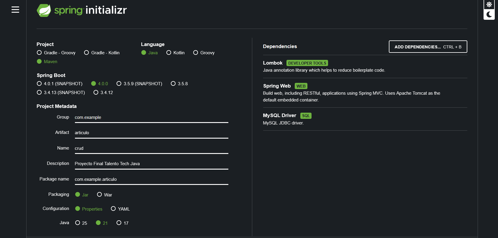

# CRUD de Artículos – Spring Boot + MySQL

Proyecto realizado como parte del Trabajo Final de Talento Tech Java.

## Demo en video

Podés ver una demostración de la API funcionando en el siguiente video:

[Ver demo en YouTube](https://www.youtube.com/watch?v=)

## Tecnologías utilizadas

- Java 21
- Spring Boot 4
- Spring Web
- Spring Data JPA
- MySQL 5.7
- Maven

## Descripción

API REST simple para gestionar artículos.  
Permite realizar operaciones CRUD sobre la entidad `Articulo`:

- Listar todos los artículos activos
- Listar todos los artículos inactivos
- Listar todos los artículos
- Obtener un artículo por ID
- Crear un nuevo artículo
- Actualizar un artículo existente
- Eliminar un artículo

## Modelo de datos

`Articulo`:

- `id` (Long) – clave primaria, autoincremental
- `nombre` (String)
- `precio` (Double)
- `imagen` (String) – URL o ruta de imagen
- `activo` (Boolean) - Usado para el borrado lógico

## Configuración del proyecto en Spring Initializr



## Configuración de la base de datos

En el archivo `src/main/resources/application.properties` se configura la conexión a MySQL:

```properties
spring.datasource.url=jdbc:mysql://localhost:3306/ARTICULOS_DB?useSSL=false&serverTimezone=UTC
spring.datasource.username=root
spring.datasource.password=root
spring.jpa.hibernate.ddl-auto=update (sé que no es buena práctica pero lo veia necesario para las modificaciones que fui realizando en mi BD)
spring.jpa.show-sql=true
```
